# Bharath Prakash

**Backend Developer · AI & Computer Vision**

&nbsp;

[LinkedIn](https://linkedin.com/in/bharath-p-450596263) · [Email](mailto:prakashbharath28@gmail.com) · [Repositories](https://github.com/Bharath2228?tab=repositories)

---

## About Me

Backend-focused developer who likes building systems that **actually work at scale**, from schema design to API architecture. Outside of Python and SQL, I'm exploring how computer vision and ML solve real-world problems, currently by building a robot arm from scratch.

| | |
|---|---|
| 🔨 **Building** | [3-DOF Robot Arm](https://github.com/Bharath2228/3-dof-bot): kinematics, computer vision, control systems |
| 📚 **Learning** | Machine Learning · Deep Learning · System Design |
| 🎯 **Interested in** | Backend architecture, automation, intelligent systems |
| 💼 **Open to** | <!-- e.g. Backend / ML internships, freelance, collaboration --> |
| 📫 **Reach me** | [prakashbharath28@gmail.com](mailto:prakashbharath28@gmail.com) |

---

## Featured Projects

### [3-dof-bot](https://github.com/Bharath2228/3-dof-bot)

Forward and inverse kinematics, OpenCV object tracking, and servo control for a 3-degree-of-freedom robotic arm.

### [Your backend project name](https://github.com/Bharath2228/REPO-NAME)

<!-- Add one backend project: what it does, scale/numbers (e.g. "handles 10k req/min"), and the stack. -->
One-line description of the problem it solves and the key result.

[**Browse all repositories →**](https://github.com/Bharath2228?tab=repositories)

---

## Tech Stack Usage

Computed from the bytes of code in my public, non-fork repos. A GitHub Action refreshes this card every day.

---

## Tech Stack

**Languages**

**Backend & Data**

**Databases**

**Frontend**

**Tools & Platforms**

---

## Connect

